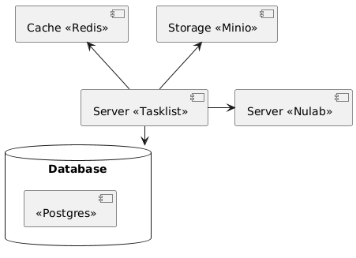

# Tasklist

This application is designed to allow team members to create and manage tasks for themselves.
The application allows you to register, log in and manage the life cycle of your tasks.

The application also allows you to create new tasks specifically for the Nulab system, or integrate existing tasks into the system (limited functionality is currently available).

You can see the available endpoints through Swagger: [http://localhost:8080/swagger-ui.html](http://localhost:8080/swagger-ui.html)

## Component Diagram

## Class Diagram

## Sequence Diagram

### Tasks related operations:

### Nulab related operations:

### 'getPublishInNulab' related operations:

'getPublishInNulab' parameter is responsible for sending the task to Nulab when it is created.

If 'getPublishInNulab' is set to true, **tasklist** will validate the request data and if validation is successful,
it will send the task to Nulab asynchronously. If an error occurs, a record about it will be written to the log.

'getPublishInNulab' is set to false by default.

## Quickstart

For the system to work correctly, you will need a .env file in root directory with the appropriate data.
You can use the .env.example file as a template.